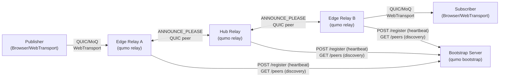
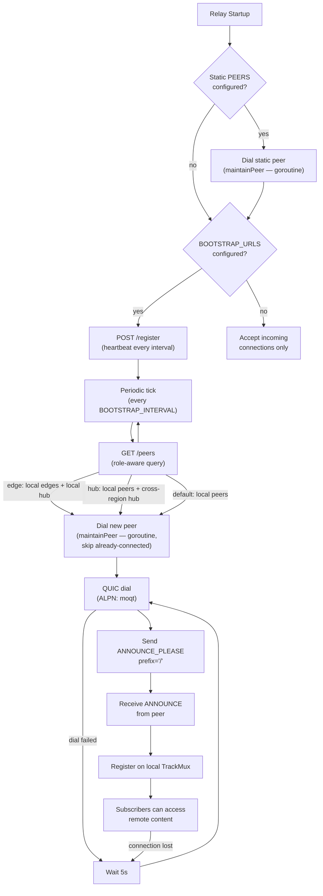

# qumo

[](https://github.com/okdaichi/qumo/actions/workflows/ci.yml)
[](https://goreportcard.com/report/github.com/okdaichi/qumo)
[](LICENSE)

**qumo** is a high-performance Media over QUIC (MoQ) relay server with intelligent topology management, enabling distributed media streaming over the QUIC transport protocol.

## Features

- 🚀 **High-Performance Relay**: Built on QUIC for low-latency media streaming
- 📡 **MoQT Protocol**: Full Media over QUIC Transport support (moq-lite draft-03)
- 🔗 **Peer-Based Topology**: Relays connect to each other via ANNOUNCE_PLEASE for decentralized content discovery
- 📊 **Observability**: Prometheus metrics, health probes, and status APIs
- 🔒 **TLS Security**: Built-in TLS 1.3 support for encrypted connections
- 🐳 **Docker-Support**: Env-var zero-config; prebuilt multi-arch images on GHCR (ghcr.io/okdaichi/qumo)

## Installation

#### Option 1: Install via Go

```bash
go install github.com/okdaichi/qumo@latest
```

#### Option 2: Download Binary

Download the latest binary from [GitHub Releases](https://github.com/okdaichi/qumo/releases):

```bash
# Linux/macOS
curl -L https://github.com/okdaichi/qumo/releases/latest/download/qumo-linux-amd64 -o qumo
chmod +x qumo
export ADVERTISE_ADDR=localhost:4433
export INSECURE=true
./qumo relay

# Windows: download qumo-windows-amd64.exe from the releases page
```

#### Option 3: Docker

See [docker/README.md](docker/README.md) for compose examples, GHCR usage, and deployment options.

#### Option 4: Build from Source

```bash
git clone https://github.com/okdaichi/qumo.git
cd qumo
mage build        # builds bin/qumo with version info
# or: go build -o qumo .
```

## Usage

```bash
qumo relay       # Start MoQ relay server (QUIC/MoQT, WebTransport, peer mesh)
qumo bootstrap   # Start bootstrap discovery server (HTTP peer registry)
qumo rtmp        # Start RTMP ingest server (bridges RTMP → MoQT)
qumo version     # Print build-time version info
```

For environment variables and configuration, see `relay-config.example.env` and `bootstrap-config.example.env`. For Docker-based deployment, see [docker/README.md](docker/README.md).

## Architecture

### System Overview



### Peer Discovery Lifecycle



## Development

### Requirements

- **Go 1.26+** — [Download](https://golang.org/dl/) or use your package manager
- **Deno** (optional, for web demo) — [Download](https://deno.land/) — see [solid-deno/README.md](solid-deno/README.md) for setup
- **Mage** — Build automation tool
  ```bash
  go install github.com/magefile/mage@latest
  ```
  Then run `mage help` to see all available tasks.

For complete Mage documentation and all available targets, see [magefiles/README.md](magefiles/README.md).

### Project Structure

```
qumo/
├── docker/                     # Docker artifacts & docs
│   ├── Dockerfile              # Multi-stage container build
│   ├── docker-compose.yml               # Single relay (local build)
│   ├── docker-compose.external.yml      # Single relay (GHCR prebuilt)
│   ├── docker-compose.topology.yml      # Full 3-region topology (bootstrap + hub + edge)
│   └── README.md               # Docker usage guide
│
├── internal/                   # Core implementation
│   ├── cli/                    # CLI entrypoints & env-var config
│   ├── relay/                  # Relay server (handlers, peer connections, caching)
│   ├── bootstrap/              # Bootstrap server & client (peer discovery via HTTP)
│   ├── rtmp/                   # RTMP utilities
│   ├── ingest/                 # RTMP ingest & FLV parsing
│   └── version/                # Version info
│
├── magefiles/                  # Build automation (Mage tasks)
│
├── certs/                      # TLS certificate examples
├── benchmarks/                 # Performance benchmarks
├── examples/                   # Usage examples
├── .github/workflows/          # CI/CD pipelines
├── go.mod & go.sum             # Go dependencies
└── main.go                     # Entry point
```

### Build System (Mage)

See [magefiles/README.md](magefiles/README.md) for the complete reference. Common targets:

```bash
mage build         # Build binary to bin/qumo
mage test          # Run tests
mage check         # Format, vet, and test
mage lint          # Run golangci-lint
mage docker:build  # Build Docker image
mage relay         # Run relay server locally
mage smoke         # Run cross-region streaming smoke test
```

