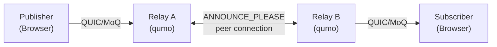
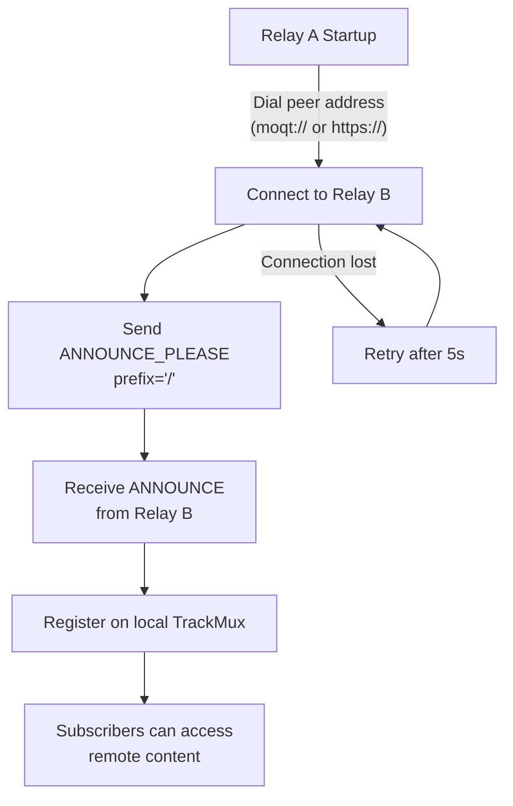

# qumo

[](https://github.com/okdaichi/qumo/actions/workflows/ci.yml)
[](https://goreportcard.com/report/github.com/okdaichi/qumo)
[](LICENSE)

**qumo** is a high-performance Media over QUIC (MoQ) relay server with intelligent topology management, enabling distributed media streaming over the QUIC transport protocol.

## Features

- 🚀 **High-Performance Relay**: Built on QUIC for low-latency media streaming
- 📡 **MoQT Protocol**: Full Media over QUIC Transport support (moq-lite draft-03)
- 🔗 **Peer-Based Topology**: Relays connect to each other via ANNOUNCE_PLEASE for decentralized content discovery
- 📊 **Observability**: Prometheus metrics, health probes, and status APIs
- 🔒 **TLS Security**: Built-in TLS 1.3 support for encrypted connections
- 🐳 **Docker-Support**: Env-var zero-config; prebuilt multi-arch images on GHCR (ghcr.io/okdaichi/qumo)

## Quick Start

### Demo Environment (short)

A complete Docker-based demo (3 peer-connected relays) and all Docker-related examples have been consolidated under `docker/`. See `docker/README.md` for quick start, compose files, and GHCR usage.

### For Developers

See [Installation](#installation) and [Development](#development) sections below.

## Installation

#### Option 1: Install via Go

```bash
go install github.com/okdaichi/qumo@latest
```

#### Option 2: Download Binary (Recommended)

Download the latest binary from [GitHub Releases](https://github.com/okdaichi/qumo/releases):

```bash
# Linux/macOS
curl -L https://github.com/okdaichi/qumo/releases/latest/download/qumo-linux-amd64 -o qumo
chmod +x qumo
./qumo relay -config <your-config.yaml>>

# Windows
# Download qumo-windows-amd64.exe from releases page
```

#### Option 3: Docker (No Build Required)

See `docker/README.md` for comprehensive Docker usage, compose examples, and deployment options. Quick example:

```bash
# Pull pre-built image from GitHub Container Registry
docker pull ghcr.io/okdaichi/qumo:latest

# Run relay (config generated from environment variables)
docker run -d \
  --name qumo-relay \
  -p 4433:4433/udp \
  -p 8080:4433 \
  -e INSECURE=true \
  -e RELAY_NAME=relay-1 \
  -e REGION=asia \
  -e ROLE=hub \
  ghcr.io/okdaichi/qumo:latest relay
```

#### Option 4: Build from Source

```bash
git clone https://github.com/okdaichi/qumo.git
cd qumo
mage build        # builds bin/qumo with version info
# or: go build -o qumo .
```

## Usage

qumo provides some subcommands for different deployment scenarios.

### version

Print build-time version information.

```bash
qumo version
# qumo v0.3.0
#   commit: f5a09bf
#   built:  2026-02-14T02:08:26Z
#   go:     go1.26.0

# Also works with:
qumo --version
qumo -v
```

### relay

Start a media relay server that forwards MoQ streams between publishers and subscribers.
<your-config.yaml>
```

**Configuration:**
See `docker/docker-compose.topology.yml` for a full 3-region example with bootstrap, hub and edge nodes. Configuration is generated from environment variables in Docker — see `docker/docker-entrypoint.sh` for all supported variable

**Configuration:**
See `docker/docker-compose.topology.yml` for a full 3-region example with bootstrap, hub and edge nodes. Configuration is generated from environment variables in Docker — see `docker/docker-entrypoint.sh` for all supported variables.

**Key Features:**
- Fan-out media track forwarding
- Prometheus metrics export // WIP
- Peer-based announce relay via ANNOUNCE_PLEASE (draft-03)

**API Endpoints:**
- `GET /health` - Health probes
  - `GET /health?probe=ready` - Readiness probe
  - `docker/README.md](docker/README.md) for Docker-based environment variables, compose examples, and deployment options
- `GET /metrics` - Prometheus metrics

See [docker/README.md](docker/README.md) for Docker-based environment variables, compose examples, and deployment options.

## Architecture

### System Overview



### Peer Discovery Lifecycle



## Development

### Requirements

- **Go 1.26+** — [Download](https://golang.org/dl/) or use your package manager
- **Deno** (optional, for web demo) — [Download](https://deno.land/) — see [solid-deno/README.md](solid-deno/README.md) for setup
- **Mage** — Build automation tool
  ```bash
  go install github.com/magefile/mage@latest
  ```
  Then run `mage help` to see all available tasks.

For complete Mage documentation and all available targets, see [magefiles/README.md](magefiles/README.md).

### Project Structure

```
qumo/
├── docker/                     # Docker artifacts & docs
│   ├── Dockerfile              # Multi-stage container build
│   ├── docker-entrypoint.sh    # Auto-config from env vars
│   ├── docker-compose.yml      # Local build + dev
│   ├── docker-compose.external.yml  # GHCR-based deployment
│   ├── docker-compose.simple.yml    # Demo (3 peer-connected relays)
│   └── README.md               # Docker usage guide
│
├── internal/                   # Core implementation
│   ├── cli/                    # CLI entrypoints & config loading
│   ├── relay/                  # Relay server (handlers, peer connections, caching)
│   ├── rtmp/                   # RTMP utilities
│   ├── ingest/                 # RTMP ingest & FLV parsing
│   └── version/                # Version info
│
├── magefiles/                  # Build automation (Mage tasks)
│
├── deploy/                     # Observability stack
│   ├── otel-collector-config.yaml
│   ├── prometheus.yaml
│   └── grafana/
│
├── 
├── certs/                      # TLS certificate examples
├── benchmarks/                 # Performance benchmarks
├── examples/                   # Usage examples
├── 
├── .github/workflows/          # CI/CD pipelines
├── go.mod & go.sum             # Go dependencies
└── main.go                     # Entry point
```

### Build System (Mage)

Quick usage (see [magefiles/README.md](magefiles/README.md) for complete reference).

- **Mage repository:** https://github.com/magefile/mage — official site: https://magefile.org/

```bash
mage build         # Build binary to bin/qumo
mage test          # Run tests
mage check         # Format, vet, and test
mage docker:build  # Build Docker image
mage demo:up       # Start 3-relay peer demo
mage relay         # Run relay server
```

### Building with Version Info

Version metadata is embedded into the binary at build time via `-ldflags`. Use `mage build` (recommended) to produce artifact(s) with version information. For the manual `go build -ldflags` command and examples, see the `Build & Install` section in `magefiles/README.md`.

## Deployment

For systemd and Kubernetes deployment examples see `deploy/README.md`.  
> ⚠️ These examples are provided as *experimental/informational* samples and have not been fully validated by the project maintainers — use at your own risk. PRs to improve them are welcome.

## Troubleshooting

- **TLS errors**: Regenerate certificates (see Quick Start)
- **Port in use**: Check with `lsof -i :4433` or `netstat -ano`