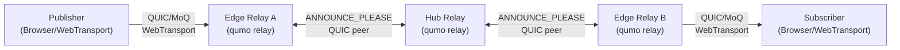
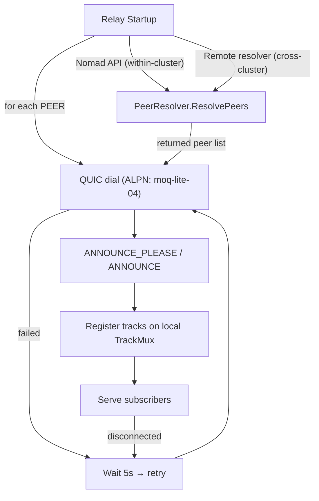

## System overview

A node's role (`--role hub`, `--role edge`, or unset for a flat/standalone
relay) is a CLI flag on `qumo relay` — see [CLI → relay]().

## Peer discovery

On startup, each relay discovers peers through one or more `PeerResolver`
implementations:

1. **Static peers** (`PEERS`) — dial each address directly and maintain the connection.
2. **Nomad native discovery** (within-cluster) — automatically discovers peers within
   the same Nomad cluster via the Nomad service API. Edges discover all local
   hubs; hubs discover nothing locally (no local hub↔hub connections). See
   [Nomad]().
3. **Remote resolver** (cross-cluster, optional) — queries an external traffic
   resolver API (e.g. qumo-enterprise) for cross-cluster hub discovery. Hubs
   discover remote hubs; edges never query the remote resolver.

Each connection dials QUIC with ALPN `moqt`, exchanges `ANNOUNCE_PLEASE` /
`ANNOUNCE`, and registers the peer's tracks on the local `TrackMux`. On
disconnect the connection is retried after 5s.

## Route election

When more than one peer path can serve the same broadcast, the relay elects
one active route and keeps the losers as retained alternates, promoted if the
incumbent's announcement ends. This is visible via the
`qumo_relay_route_replacements_total`, `qumo_relay_routes_retained`, and
`qumo_relay_route_promotions_total` metrics — see
[Observability]().

## Graceful migration

Route/subscription migration (make-before-break via route election) is the
primary mobility mechanism. `GOAWAY_REDIRECT_URI` is an escape-hatch: on
shutdown, it redirects clients/peers to a successor relay. See
[Configuration](#graceful-migration--goaway-optional).

## Related

- [Docker]() — `docker-compose.static.yml` wires a full 3-region topology with static `PEERS`.
- [Nomad]() — exercises the Nomad-native `LocalResolver` path.
- [Configuration → Static peers](#static-peers) and [Local resolver](#local-resolver--nomad-native-discovery).
